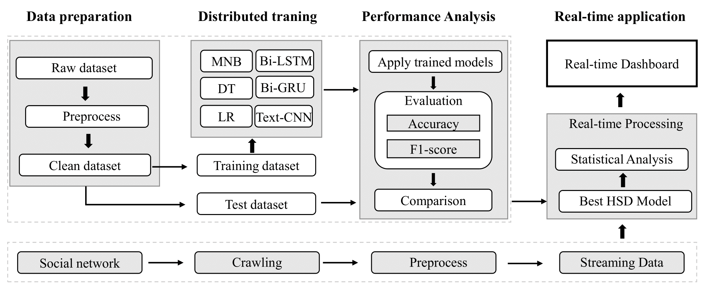
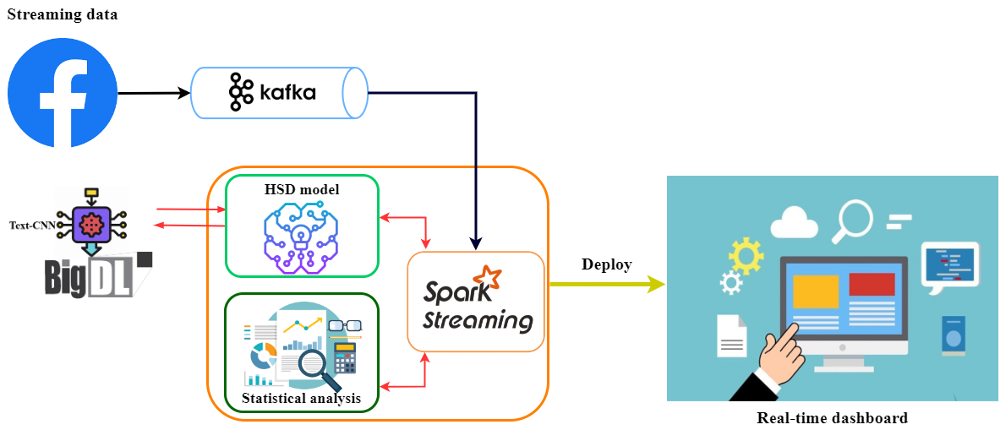

# Remove-hate-speech-comments-on-Facebook

This repository contains the source code and documentation for a Hate Speech Detection System. The system aims to detect hate speech in user comments retrieved from Facebook using the Selenium framework. It utilizes distributed training with BigDL to train multiple hate speech detection models, and integrates the best model into Spark Streaming for real-time prediction. The prediction results are statistically visualized on a website interface through real-time dashboards.

# Introduction

Hate speech has become a growing concern in online platforms. This Hate Speech Detection System aims to automatically identify and classify hate speech comments from user-generated content. The system utilizes a distributed approach for training multiple hate speech detection models using BigDL. The best model is integrated into Spark Streaming to perform real-time predictions on user comments retrieved from Facebook. My *Experimental procedure* is as follows:

# System Overview

The Hate Speech Detection System consists of several components that work together to achieve the goal of detecting hate speech in user comments and providing statistical analysis of the comments. The major components are as follows:

1. **Data Retrieval**: The system uses the Selenium framework to crawl user comments from Facebook. A keyword can be specified to search for relevant pages, and the comments from each article are retrieved and stored as JSON data.

2. **Data Preprocessing**: The retrieved user comments undergo preprocessing steps such as word splitting and normalizing to lowercase letters. This ensures that the comments are in a suitable format for further analysis.

3. **Model Training**: Distributed training is performed using BigDL to train multiple hate speech detection models. These models are trained on a labeled dataset and aim to classify comments as hate speech or non-hate speech.

4. **Real-time Prediction**: The best model obtained from the training process is integrated into Spark Streaming. The preprocessed user comments are encoded from text to numerical representation to match the input of the predictive model. Spark Streaming then passes the encoded data to the model to predict the label for each comment in real-time.

5. **Statistical Analysis**: The prediction results from the hate speech detection model are utilized to provide statistical analysis of the comments. Real-time dashboards are used to visualize the analysis, enabling users to gain insights into the prevalence of hate speech and its characteristics.
